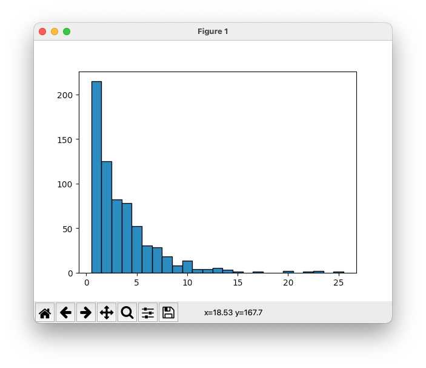

# Week 1 (2026/4/10)

!!! abstract "今週の目的"
    ファイルのデータを集計してヒストグラムを作成する。

!!! check "今週のキーワード"
    - ファイル入出力(読み込み、書き込み)
    - 条件分岐(条件判断)、繰り返し処理(ループ)
    - 文字列処理
    - リストのスライス

ファイルからデータを読込み、文字列処理を行い、その結果を表示するプログラムを作成する。読込むデータファイルは[`kyotocitybus_stop.dat`:material-file:](files/kyotocitybus_stop.dat){download="kyotocitybus_stop.dat"}とする。[^1]

ファイルは半角スペース区切りで、左から1列目はバス停ID、2列目はバス停の名称、3列目はバス停の緯度、4列目はバス停の経度、5列目以降はそのバス停に停まるバスの路線である。

[^1]:[国土交通省国土政策局 国土数値情報(バス停留所)](http://nlftp.mlit.go.jp/ksj/gml/datalist/KsjTmplt-P11.html)をもとに加工


## :material-chevron-right:課題1　ファイルから入力する
`kyotocitybus_stop.dat`ファイルを読み込み、カンマ区切りで出力するよう、以下のプログラムの穴あき部分を埋めてプログラムを完成させよ。また、実行例の通りに動くことを確認せよ。

=== "プログラム"
    ``` py linenums="1" title="week1_1.py"
    # 穴埋め問題用プログラム
    fi = [____]('kyotocitybus_stop.dat', '[____]', encoding = 'utf-8')
    lines = fi.readlines()
    [____]:
        line = line.rstrip()
        items = line.split(' ')  # 1行を半角スペースで区切ってitems リストに代入
        print(','.join(items))  # カンマを区切り文字としてitemsリストの要素を連結
    fi.close()
    ```

=== "実行例"
    ```
    ED01_1637,西賀茂車庫前,35.06385669,135.74499864,1号系統,37号系統,9号系統,快速9号系統,特37号系統
    ED01_1638,神光院前,35.06134071,135.74395031,1号系統,37号系統,9号系統,快速9号系統,特37号系統
    (途中省略)
    ED01_4089,京都駅前,34.98719397,135.75802795,100号系統,101号系統,16号系統,17号系統,19号系統,205号系統,206号系統,208号系統,26号系統,28号系統,33号系統,42号系統,4号系統,50号系統,5号系統,73号系統,75号系統,78号系統,81号系統,9号系統,南5号系統,快速205号系統,快速9号系統,特33号系統,特81号系統
    ED01_4102,京都駅八条口,34.98401063,135.75866056,16号系統,19号系統,78号系統
    ```

<!-- $$
\boxed{\phantom{hogehoge}}
$$ -->

## :material-chevron-right:課題2　ファイルに出力する
標準出力に出力している内容を、ファイルに出力するようプログラムを修正せよ。出力先のファイル名は`kyotocitybus_stop_comma.dat`とする。`kyotocitybus_stop_comma.dat`に課題1の実行例が書き込まれていることを確認せよ。

なお、リダイレクトによるファイル出力は行わないこと。

!!! info "標準入出力"
    プログラムを実行しているプロセスのデフォルトの入出力を*標準入出力*と呼ぶ。通常は、ターミナルが指定されているので、`print('Hello!')`を実行すると、ターミナル上に`Hello!`と表示される。その標準出力の出力先をファイルなどに変更することを*リダイレクト*と呼ぶ。また、あるプロセスの標準出力を別のプロセスの標準入力に接続することを*パイプ*と呼ぶ。

## :material-chevron-right:課題3　データを探す
「立命館大学前」のバス停に停まる全ての路線を標準出力に出力するようプログラムを修正し、実行例の通りに動くことを確認せよ。なお、「立命館大学前」のバス停に停まる路線は、`kyotocitybus_stop.dat`から取得するようにプログラムを修正すること。

=== "実行例"
    ```
    12号系統,15号系統,50号系統,51号系統,55号系統,59号系統,M1号系統,快速202号系統,快速205号系統
    ```

## :material-chevron-right:発展課題4　データを数える
停車する路線本数ごとにバス停を集計し、標準出力に出力するようプログラムを修正し、実行例の通りに動くことを確認せよ。

!!! hint "ヒント"
    停車する路線本数ごとにバス停を集計するには、**辞書**を利用するとよい。
    辞書のキーを停車するバスの路線本数に、辞書の値をバス停の数に設定しよう。

=== "実行例"
    ```
    5本のバス路線が通っている停留所の合計は52個です。
    1本のバス路線が通っている停留所の合計は215個です。
    3本のバス路線が通っている停留所の合計は82個です。
    4本のバス路線が通っている停留所の合計は78個です。
    12本のバス路線が通っている停留所の合計は4個です。
    7本のバス路線が通っている停留所の合計は28個です。
    9本のバス路線が通っている停留所の合計は8個です。
    15本のバス路線が通っている停留所の合計は1個です。
    13本のバス路線が通っている停留所の合計は5個です。
    6本のバス路線が通っている停留所の合計は30個です。
    10本のバス路線が通っている停留所の合計は13個です。
    22本のバス路線が通っている停留所の合計は1個です。
    2本のバス路線が通っている停留所の合計は125個です。
    8本のバス路線が通っている停留所の合計は18個です。
    11本のバス路線が通っている停留所の合計は4個です。
    20本のバス路線が通っている停留所の合計は2個です。
    14本のバス路線が通っている停留所の合計は3個です。
    23本のバス路線が通っている停留所の合計は2個です。
    17本のバス路線が通っている停留所の合計は1個です。
    25本のバス路線が通っている停留所の合計は1個です。
    ```

## :material-chevron-right:発展課題5　データを集計して棒グラフでヒストグラムを作る
[発展課題4](#4)で集計した、停車する路線本数ごとのバス停の数を棒グラフで表示しヒストグラムを作成するようプログラムを修正し、実行例の通りに動くことを確認せよ。

!!! hint "ヒント"
    棒グラフを作るには、`matplotlib.pyplot`モジュールを`import`し、以下の`bar`関数を用いるとよい。今回の場合は、第一引数にバス停に停まる路線本数のリスト、第二引数にx軸の路線本数だけ停車するバス停の数のリストを用いよう。最後に、`#!python matplotlib.pyplot.show()`を実行することで、作成した棒グラフを表示することができる。

!!! example "bar関数"
    <!-- ``` py
    matplotlib.pyplot.bar(x, height, width=0.8)
    ``` -->
    **`#!python matplotlib.pyplot.bar(x, height, width=0.8)`**  
    棒グラフを作成する関数

    **パラメータ**

    - **x**: 棒グラフのx座標の値のリスト
    - **height**: 棒グラフのy座標の値のリスト
    - **width**: 棒グラフの棒の幅（デフォルト0.8）。棒間の隙間を無くすには1.0に設定する。

    **使用例**
    ``` py
    import matplotlib.pyplot as plt
    plt.bar([1, 2, 3], [3, 2, 1], width=1.0)
    plt.show()
    ```

    APIの詳細は[公式のページ](https://matplotlib.org/stable/api/_as_gen/matplotlib.pyplot.bar.html){target="_blank"}を参照すること。


=== "実行例"
    { align=left }
