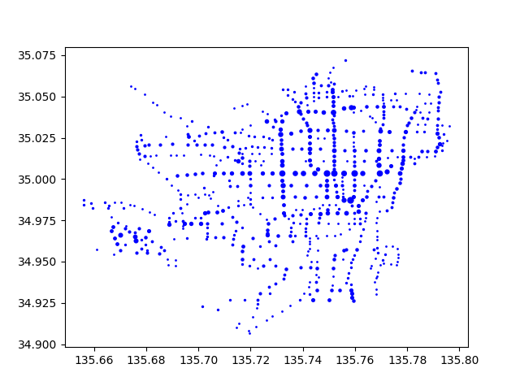

# Week 2 (2026/4/17)

!!! abstract "今週の目的"
    ファイルのデータからインスタンスを作成する。

<!-- !!! check "前回までのあらすじ"
    - 標準出力する方法を学習
    - ファイルの入出力を学習
    - 条件分岐、ループといった基本的な制御構造を学習 -->

!!! check "今週のキーワード"
    - クラス
    - インスタンス変数
    - インスタンス生成
    - メソッド、メソッド呼び出し

[第１回課題](index.md)のデータファイルを用いて、クラスのインスタンスを生成し、各インスタンスのインスタンス変数の値を表示するプログラムを作成する。

今回作成する`Stop`クラスの仕様は、以下の通りである。

!!! example "Stopクラス"
    **`#!python class Stop(id, name, lat, lng)`**  
    バス停の情報（バス停ID、バス停の名称、バス停の緯度、経度）を格納するためのクラス

    **パラメータ**

    - **id**: バス停ID（文字列）
    - **name**: バス停の名称（文字列）
    - **lat**: バス停の緯度（浮動小数点）
    - **lng**: バス停の経度（浮動小数点）

<!-- ### class **Stop**(*id*, *name*, *lat*, *lng*) -->
<!-- ### ***`#!python class Stop(id, name, lat, lng)`*** -->
<!-- **パラメータ**

- **_id_**: バス停ID
- **_name_**: バス停の名称
- **_lat_**: バス停の緯度
- **_lng_**: バス停の経度 -->

## :material-chevron-right:課題1：インスタンスを作る
4つの`Stop`クラスのインスタンスを生成するよう、下のプログラムの穴あき部分を埋めて模写し、実行例の通りに動くことを確認せよ。

=== "プログラム"
    ```python linenums="1" title="week2_1.py"
    # 穴埋め問題用プログラム
    # Stopクラスの定義
    class Stop:
        def __init__(self, id, name, lat, lng): # 初期化メソッド
            [____].id = id # インスタンス変数に値を代入
            [____].name = name
            [____].lat = lat
            [____].lng = lng


    # ここからメインの処理
    # バス停IDがED01_1914、バス停の名称が立命館大学前、緯度が35.03497163、経度が135.72602961であるStopクラスのインスタンスritsumeikanを生成
    ritsumeikan = Stop('ED01_1914', '立命館大学前', 35.03497163, 135.72602961)
    doshisha = Stop('ED01_1922', '同志社前', 35.02913136, 135.76314762)
    kyodai = Stop('ED01_1841', '京大正門前', 35.02548675, 135.7786403)
    kyosan = Stop('ED01_2244', '京都産大前', 35.07182049, 135.75638731)

    # Stopクラスの各インスタンスのインスタンス変数を表示
    message = '{}(ID:{})のバス停の緯度経度は({},{})です。'
    print(message.format([____], [____], [____], [____]))
    print(message.format([____], [____], [____], [____]))
    print(message.format([____], [____], [____], [____]))
    print(message.format([____], [____], [____], [____]))
    ```

=== "実行例"
    ```
    立命館大学前(ID:ED01_1914)のバス停の緯度経度は(35.03497163,135.72602961)です。
    同志社前(ID:ED01_1922)のバス停の緯度経度は(35.02913136,135.76314762)です。
    京大正門前(ID:ED01_1841)のバス停の緯度経度は(35.02548675,135.7786403)です。
    京都産大前(ID:ED01_2244)のバス停の緯度経度は(35.07182049,135.75638731)です。
    ```

## :material-chevron-right:課題2：インスタンス変数を追加する
`Stop`クラスの定義に、バスの路線を格納するリスト型のインスタンス変数`routes`を追加せよ。また、`kyotocitybus_stop.dat`ファイルから読込んだ各バス停のデータ（名前、ID、緯度、経度、バスの路線）を使って`Stop`クラスのインスタンスを生成しなさい。

さらに、最後から100番目のバス停のデータを表示するようプログラムを修正し、実行例の通りに動くことを確認せよ。読込むデータファイルは前回と同じ`kyotocitybus_stop.dat`を用いること。

ファイルの1列目はバス停ID、2列目はバス停の名称、3列目はバス停の緯度、4列目はバス停の経度、5列目以降はそのバス停に停まるバスの路線である。

!!! hint "ヒント"
    [第１週の課題１](index.md)を参考にしてファイルからデータを読み込み、各バス停のデータを標準出力していた箇所で`Stop`クラスのインスタンスを生成しよう。ただし、ファイルから読み込んだデータは全て文字列であることに注意して、 `Stop`インスタンスを生成するときは、文字列を適切な型に変換しておくこと。また、生成した`Stop`インスタンスをリストに追加しておくと、最後から100番目のバス停のデータにアクセスしやすくなる。なお、リストの最後の要素にアクセスするには、インデックスに`-1`を指定すればよい。また、バス路線のリスト`routes`をコンマ区切りで連結するには、文字列の`join()`メソッドを用いるとよい。

=== "実行例"
    ```
    莚田町(ID:ED01_2210)のバス停の緯度経度は(34.97052333,135.7032473)です。69号系統,特南1号系統のバスが停まります。
    ```

## :material-chevron-right:課題3：メソッドを追加する
各バス停に停まる路線の本数を返す`count_routes()`メソッドを`Stop`クラス内に定義しなさい。

今回作成する`count_routes`メソッドの仕様は、以下の通りである。

!!! example "count_routesメソッド"
    **`#!python count_routes()`**  
    バス停に停まる路線の本数を返すメソッド

    **返り値**

    - 停車する路線の本数（整数）

!!! hint "ヒント"
    路線の本数を数えるには、`len`関数を用いてインスタンス変数`routes`のリストの長さを求めればよい。

さらに、最後から500番目のバス停に停車するバスの路線の本数を表示するようプログラムを修正し、実行例の通りに動くことを確認せよ。

=== "実行例"
    ```
    千本鞍馬口(ID:ED01_1810)のバス停には4本の路線が通っています。
    ```

## :material-chevron-right:発展課題4：散布図でデータを表示する
`Stop`インスタンスのリストを用いて、各バス停の経度（`lng`）をx座標に、緯度（`lat`）をy座標にプロットして散布図を作成し表示しなさい。また、バス停に停車するバスの路線の本数に応じてプロットしたマーカの色を変えて、実行例の通りに表示されることを確認せよ。

!!! hint "ヒント"
    散布図を作成するには`matplotlib.pyplot`の`scatter`関数を用いよう。第一引数にx座標のデータ(列)、第二引数にy座標のデータ(列)を与える。また、プロットするデータのサイズはキーワード付き引数`s`にそのサイズの大きさを表すデータ(列)を与える。今回の場合は、第一引数に各バス停の経度`lng`、第二引数に各バス停の緯度`lat`、キーワード付き引数`s`に各バス停の`count_routes()`の値を用いればよい。

!!! example "scatter関数"
    <!-- ``` py
    matplotlib.pyplot.scatter(x, y, c=None)
    ``` -->
    **`#!python matplotlib.pyplot.scatter(x, y, c=None)`**  
    散布図を作成する関数

    **パラメータ**

    - **x**: データのx座標の値/リスト
    - **y**: データのy座標の値/リスト
    - **s**: データのマーカーのサイズの値/リスト

    **使用例**
    ``` py
    import matplotlib.pyplot as plt
    plt.scatter(3, 4, s=5)
    plt.scatter([1, 2, 3], [3, 2, 1], s=[1, 2, 3])
    plt.show()
    ```

    APIの詳細は[公式のページ](https://matplotlib.org/stable/api/_as_gen/matplotlib.pyplot.scatter.html){target="_blank"}を参照すること。

=== "実行例"
    { align=left }
