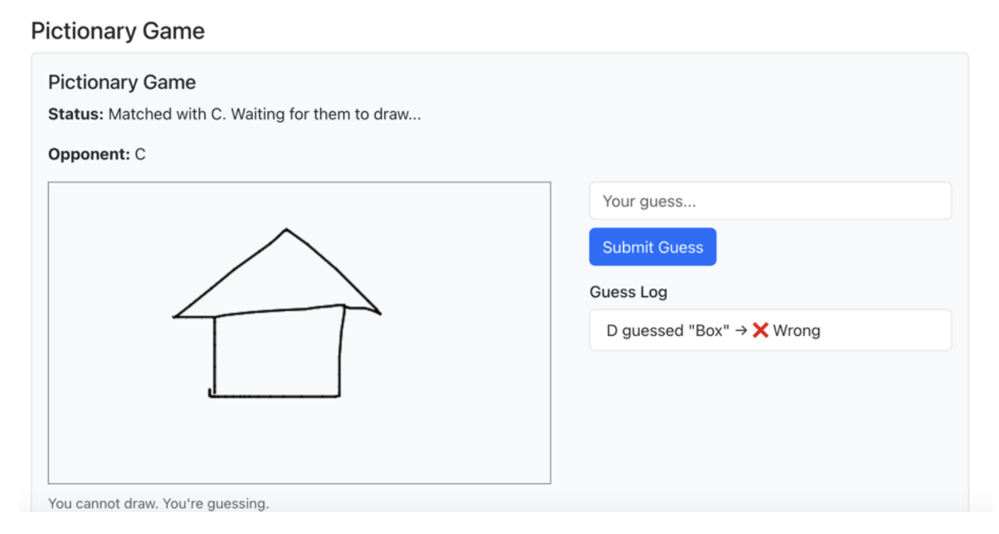
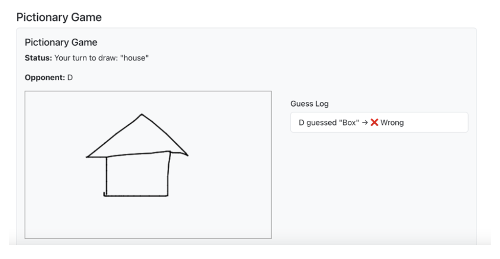

# 参考例：Pictionary ゲーム

!!! info "このページについて"
    このページは、第2回レポート課題の参考として用意した Pictionary ゲームの実装例である。  
    Pictionary は「お絵描き当てゲーム」であり、1人が絵を描き、もう1人がその絵を見て単語を当てるゲームである。

    このページの目的は、Socket.IO を使ったリアルタイム描画共有と、2人対戦型ゲームの作り方を理解することである。

!!! warning "重要"
    このページは「参考例」である。  
    Pictionary ゲームを必ず作る必要はない。  
    また、このコードをそのまま提出することは不可である。

    第2回レポート課題として提出する場合は、ルール、画面デザイン、単語リスト、スコア機能、ヒント機能などに、自分なりの改良を加えること。

---

## 1. このゲームで作るもの

このページでは、Socket.IO を用いて、2人で対戦できる Pictionary ゲームを作成する。

Pictionary ゲームでは、2人のプレイヤーが次の役割に分かれる。

| 役割 | 説明 |
|---|---|
| Drawer | お題の単語を見て、キャンバスに絵を描く人 |
| Guesser | 絵を見て、単語を推測して入力する人 |

描き手（Drawer）は、画面に表示された単語を見ながら絵を描く。  
当てる側（Guesser）は、その絵を見て答えを入力する。

正解すると、キャンバスがクリアされ、次のラウンドに進む。



*図1：当てる側（Guesser）の画面例*



*図2：描き手（Drawer）の画面例*

---

## 2. この例で学ぶこと

この例では、以下の内容を学ぶことができる。

- Socket.IO を使って2人をマッチングする方法
- プレイヤーに Drawer / Guesser の役割を割り当てる方法
- Canvas の描画データを相手に送る方法
- 相手の画面にリアルタイムで線を表示する方法
- 入力された単語をサーバー側で判定する方法
- 正解後にキャンバスをクリアする方法
- React コンポーネントを分けて管理する方法

---

## 3. 完成時のファイル構成

この例では、React 側に `PictionaryGame.js` と `PaintBoard.js` を追加する。

開発中のフォルダ構成は、次のようになる。

```text
report2/
├── client/
│   └── src/
│       ├── App.js
│       ├── PictionaryGame.js
│       ├── PaintBoard.js
│       └── ...
└── server/
    └── server.js
```

!!! note "注意"
    `PictionaryGame.js` と `PaintBoard.js` は `client/src/` の中に作成する。  
    `server.js` は `server/` の中にあるファイルを編集する。

---

## 4. ゲーム全体の流れ

Pictionary ゲームの基本的な流れは次の通りである。

1. ユーザーAが Pictionary ゲームに参加する
2. ユーザーAは待機キューに入る
3. ユーザーBが Pictionary ゲームに参加する
4. サーバーがユーザーAとユーザーBをマッチングする
5. サーバーが片方を Drawer、もう片方を Guesser にする
6. Drawer の画面に描くべき単語が表示される
7. Drawer がキャンバスに絵を描く
8. 描画データが Socket.IO で Guesser に送られる
9. Guesser が答えを入力する
10. サーバーが答えを判定する
11. 正解すると、両方のキャンバスがクリアされる
12. 役割が入れ替わり、次のラウンドに進む

---

## 5. 主な Socket.IO イベント

このゲームでは、主に次の Socket.IO イベントを使う。

| イベント名 | 送信元 | 送信先 | 役割 |
|---|---|---|---|
| `join_pictionary` | クライアント | サーバー | Pictionary への参加を要求する |
| `matched` | サーバー | クライアント | 対戦相手と自分の役割を通知する |
| `set_word` | クライアント | サーバー | Drawer が選んだ単語をサーバーに送る |
| `draw_line` | クライアント | サーバー / 相手 | 描画した線の座標を送る |
| `guess_word` | クライアント | サーバー | Guesser が推測した単語を送る |
| `guess_result` | サーバー | クライアント | 推測結果を通知する |
| `clear_canvas` | サーバー | クライアント | キャンバスを消去する |

!!! tip "レポートで使える内容"
    第2回レポートでは、使用した Socket.IO イベントを表にまとめる必要がある。  
    上の表は、レポートの「内部仕様」の参考にできる。

---

## 6. サーバー側の実装

ここからは、`server/server.js` に Pictionary ゲーム用の処理を追加する。

---

### 6.1 ゲーム状態を管理する変数を追加する

まず、Pictionary ゲームの状態を管理するために、次の2つの変数を追加する。

```js
const pictionaryQueue = []; // Pictionary の対戦待ちユーザーを入れるキュー
const activePairs = new Map(); // socket.id → { opponent, isDrawer, word }
```

追加する場所の例は次の通りである。

```js
const users = new Map();

const pictionaryQueue = []; // Pictionary の対戦待ちユーザーを入れるキュー
const activePairs = new Map(); // socket.id → { opponent, isDrawer, word }
```

#### 変数の意味

`pictionaryQueue` は、まだ対戦相手が見つかっていないユーザーを入れる配列である。  
1人目が参加した時点では、まだ対戦相手がいないため、この配列の中で待つ。

`activePairs` は、現在対戦中のプレイヤー情報を保存するための `Map` である。  
各 `socket.id` をキーとして、対戦相手、自分が Drawer かどうか、現在の単語を保存する。

!!! note "このページの実装について"
    このページでは、単語をペアごとに管理するために、`activePairs` の中に `word` を保存する。  
    これにより、複数のペアが同時に遊ぶ場合にも拡張しやすくなる。

---

### 6.2 マッチング用の関数を追加する

次に、待機中のユーザーが2人以上いれば自動的にマッチングする関数を追加する。

```js
function tryMatchPictionaryPlayers() {
  while (pictionaryQueue.length >= 2) {
    const drawer = pictionaryQueue.shift();
    const guesser = pictionaryQueue.shift();

    // 片方が切断済みの場合はスキップする
    if (!drawer.connected || !guesser.connected) {
      continue;
    }

    activePairs.set(drawer.id, {
      opponent: guesser,
      isDrawer: true,
      word: null,
    });

    activePairs.set(guesser.id, {
      opponent: drawer,
      isDrawer: false,
      word: null,
    });

    drawer.emit('matched', {
      opponentName: guesser.username,
      isDrawer: true,
    });

    guesser.emit('matched', {
      opponentName: drawer.username,
      isDrawer: false,
    });

    console.log(
      `[Pictionary] Matched ${drawer.username} (drawer) with ${guesser.username} (guesser)`
    );
  }
}
```

#### このコードの動き

この関数は、`pictionaryQueue` に2人以上いるかを確認する。  
2人いれば、先に入った2人を取り出して、片方を Drawer、もう片方を Guesser にする。

その後、両方のクライアントに `matched` イベントを送信する。  
クライアント側では、このイベントを受け取って、対戦相手の名前と自分の役割を画面に表示する。

---

### 6.3 join_pictionary イベントを追加する

`join_pictionary` は、ユーザーが Pictionary ゲームに参加するときに使うイベントである。

`io.on('connection', (socket) => { ... })` の中に、次のコードを追加する。

```js
socket.on('join_pictionary', (username) => {
  socket.username = username;

  // 同じ socket が二重にキューへ入らないようにする
  const alreadyWaiting = pictionaryQueue.find((s) => s.id === socket.id);
  const alreadyPlaying = activePairs.has(socket.id);

  if (!alreadyWaiting && !alreadyPlaying) {
    pictionaryQueue.push(socket);
    console.log(`[Pictionary] ${username} joined queue.`);
  }

  tryMatchPictionaryPlayers();
});
```

#### このコードの動き

このコードでは、まず参加したユーザーを `pictionaryQueue` に追加する。  
ただし、同じユーザーが二重にキューへ入らないように確認している。

その後、`tryMatchPictionaryPlayers()` を呼び出し、2人以上待っていればマッチングを行う。

---

### 6.4 set_word イベントを追加する

`set_word` は、Drawer がランダムに選んだ単語をサーバーに送るためのイベントである。

`io.on('connection', (socket) => { ... })` の中に、次のコードを追加する。

```js
socket.on('set_word', ({ word }) => {
  const pair = activePairs.get(socket.id);

  if (!pair || !pair.isDrawer) return;

  pair.word = word;

  const opponentPair = activePairs.get(pair.opponent.id);
  if (opponentPair) {
    opponentPair.word = word;
  }

  console.log(`[Pictionary] ${socket.username} set word: ${word}`);
});
```

#### このコードの動き

Drawer のクライアントは、単語をランダムに選び、`set_word` でサーバーへ送る。  
サーバーは、その単語をペアのゲーム状態として保存する。

Guesser には単語を表示しない。  
そのため、Guesser は絵だけを見て単語を推測する必要がある。

---

### 6.5 draw_line イベントを追加する

`draw_line` は、Drawer が描いた線の座標を送るためのイベントである。

`io.on('connection', (socket) => { ... })` の中に、次のコードを追加する。

```js
socket.on('draw_line', (data) => {
  const pair = activePairs.get(socket.id);

  // Drawer 以外は描画データを送れないようにする
  if (!pair || !pair.isDrawer || !pair.opponent) return;

  pair.opponent.emit('draw_line', data);
});
```

#### このコードの動き

Drawer がキャンバスに線を描くと、クライアントは線の座標を `draw_line` でサーバーに送る。  
サーバーは、そのデータを対戦相手である Guesser に送る。

この処理により、Drawer が描いた線が Guesser の画面にも表示される。

!!! note "なぜ io.emit ではないのか"
    `io.emit()` を使うと、接続している全ユーザーに描画データが送られる。  
    しかし、このゲームでは対戦相手にだけ送ればよい。  
    そのため、`pair.opponent.emit()` を使っている。

---

### 6.6 guess_word イベントを追加する

`guess_word` は、Guesser が答えを入力したときに使うイベントである。

`io.on('connection', (socket) => { ... })` の中に、次のコードを追加する。

```js
socket.on('guess_word', ({ guess, user }) => {
  const pair = activePairs.get(socket.id);

  // Guesser だけが答えを送れるようにする
  if (!pair || pair.isDrawer || !pair.opponent) return;

  const correct =
    guess.trim().toLowerCase() === pair.word?.trim().toLowerCase();

  console.log(`[Pictionary] ${user} guessed "${guess}" → ${correct}`);

  // 推測結果を両方のプレイヤーに送る
  socket.emit('guess_result', { user, guess, correct });
  pair.opponent.emit('guess_result', { user, guess, correct });

  if (correct) {
    const oldGuesser = socket;
    const oldDrawer = pair.opponent;

    oldGuesser.emit('clear_canvas');
    oldDrawer.emit('clear_canvas');

    setTimeout(() => {
      // 正解後は役割を入れ替える
      activePairs.set(oldGuesser.id, {
        opponent: oldDrawer,
        isDrawer: true,
        word: null,
      });

      activePairs.set(oldDrawer.id, {
        opponent: oldGuesser,
        isDrawer: false,
        word: null,
      });

      oldGuesser.emit('matched', {
        opponentName: oldDrawer.username,
        isDrawer: true,
      });

      oldDrawer.emit('matched', {
        opponentName: oldGuesser.username,
        isDrawer: false,
      });

      console.log(`[Pictionary] Next drawer: ${oldGuesser.username}`);
    }, 1000);
  }
});
```

#### このコードの動き

Guesser が答えを送ると、サーバーは現在の正解単語と比較する。  
正解か不正解かの結果は、両方のプレイヤーに送られる。

正解した場合は、両方のキャンバスを消去し、役割を入れ替える。  
その後、新しい Drawer が新しい単語を選び、次のラウンドが始まる。

---

### 6.7 disconnect 処理を拡張する

ユーザーが切断したとき、Pictionary の待機キューや対戦情報からも削除する必要がある。

すでに `disconnect` 処理がある場合は、その中に以下の処理を追加する。

```js
socket.on('disconnect', () => {
  const username = users.get(socket.id);

  if (username) {
    console.log(`User disconnected: ${username} (Socket ID: ${socket.id})`);
    users.delete(socket.id);
    broadcastUserList();
  }

  // Pictionary の待機キューから削除する
  const queueIndex = pictionaryQueue.findIndex((s) => s.id === socket.id);
  if (queueIndex !== -1) {
    pictionaryQueue.splice(queueIndex, 1);
  }

  // 対戦中だった場合は、相手を待機状態に戻す
  const pair = activePairs.get(socket.id);

  if (pair && pair.opponent) {
    const opponentSocket = pair.opponent;

    activePairs.delete(opponentSocket.id);

    if (opponentSocket.connected) {
      opponentSocket.emit('matched', {
        opponentName: null,
        isDrawer: false,
      });

      const alreadyWaiting = pictionaryQueue.find(
        (s) => s.id === opponentSocket.id
      );

      if (!alreadyWaiting) {
        pictionaryQueue.push(opponentSocket);
      }
    }
  }

  activePairs.delete(socket.id);

  tryMatchPictionaryPlayers();
});
```

!!! warning "注意"
    `disconnect` の処理を2回書くと、意図しない動作になることがある。  
    すでに `socket.on('disconnect', ...)` がある場合は、新しく作るのではなく、既存の `disconnect` の中に Pictionary 用の処理を追加すること。

---

## 7. React 側の実装：PaintBoard.js

Pictionary では、キャンバスに絵を描く必要がある。  
そのため、まず `PaintBoard.js` を作成する。

作成する場所は次の通りである。

```text
client/src/PaintBoard.js
```

---

### 7.1 PaintBoard.js の完成例

以下を `client/src/PaintBoard.js` に書く。

```jsx
import React, { useEffect, useRef, useState } from 'react';

function PaintBoard({ onDrawLine, canvasControlRef, penColor = '#000' }) {
  const canvasRef = useRef(null);
  const lastPosRef = useRef(null);
  const [isDrawing, setIsDrawing] = useState(false);

  const drawLine = (x0, y0, x1, y1, color = penColor) => {
    const canvas = canvasRef.current;
    if (!canvas) return;

    const ctx = canvas.getContext('2d');
    ctx.strokeStyle = color;
    ctx.lineWidth = 3;
    ctx.lineCap = 'round';

    ctx.beginPath();
    ctx.moveTo(x0, y0);
    ctx.lineTo(x1, y1);
    ctx.stroke();
  };

  const clearCanvas = () => {
    const canvas = canvasRef.current;
    if (!canvas) return;

    const ctx = canvas.getContext('2d');
    ctx.clearRect(0, 0, canvas.width, canvas.height);
  };

  const getXY = (e) => {
    const canvas = canvasRef.current;
    const rect = canvas.getBoundingClientRect();

    const scaleX = canvas.width / rect.width;
    const scaleY = canvas.height / rect.height;

    return {
      x: (e.clientX - rect.left) * scaleX,
      y: (e.clientY - rect.top) * scaleY,
    };
  };

  useEffect(() => {
    if (!canvasControlRef) return;

    canvasControlRef.current = {
      drawRemoteLine: drawLine,
      clearCanvas,
    };

    return () => {
      canvasControlRef.current = null;
    };
  });

  const handleMouseDown = (e) => {
    setIsDrawing(true);
    lastPosRef.current = getXY(e);
  };

  const handleMouseMove = (e) => {
    if (!isDrawing || !lastPosRef.current) return;

    const currentPos = getXY(e);
    const lastPos = lastPosRef.current;

    drawLine(lastPos.x, lastPos.y, currentPos.x, currentPos.y, penColor);

    if (onDrawLine) {
      onDrawLine(lastPos.x, lastPos.y, currentPos.x, currentPos.y);
    }

    lastPosRef.current = currentPos;
  };

  const stopDrawing = () => {
    setIsDrawing(false);
    lastPosRef.current = null;
  };

  return (
    <canvas
      ref={canvasRef}
      width={600}
      height={350}
      style={{
        border: '1px solid #999',
        backgroundColor: '#fff',
        width: '100%',
        maxWidth: '600px',
        height: '350px',
        cursor: 'crosshair',
      }}
      onMouseDown={handleMouseDown}
      onMouseMove={handleMouseMove}
      onMouseUp={stopDrawing}
      onMouseLeave={stopDrawing}
    />
  );
}

export default PaintBoard;
```

#### このコードの役割

`PaintBoard.js` は、キャンバスに線を描くためのコンポーネントである。  
マウスを押して動かすと、線が描かれる。

また、`drawRemoteLine()` により、相手から送られてきた線を描画できる。  
`clearCanvas()` により、正解時にキャンバスを消去できる。

---

## 8. React 側の実装：PictionaryGame.js

次に、ゲーム全体を管理する `PictionaryGame.js` を作成する。

作成する場所は次の通りである。

```text
client/src/PictionaryGame.js
```

---

### 8.1 PictionaryGame.js の完成例

以下を `client/src/PictionaryGame.js` に書く。

```jsx
import React, { useEffect, useRef, useState } from 'react';
import PaintBoard from './PaintBoard';

const WORDS = ['house', 'cat', 'tree', 'car', 'book', 'apple'];

function PictionaryGame({ socket, username }) {
  const canvasControlRef = useRef(null);

  const [isDrawer, setIsDrawer] = useState(false);
  const [currentWord, setCurrentWord] = useState('');
  const [guess, setGuess] = useState('');
  const [messages, setMessages] = useState([]);
  const [status, setStatus] = useState('Waiting for opponent...');
  const [opponent, setOpponent] = useState(null);

  useEffect(() => {
    if (!socket || !username) return;

    socket.emit('join_pictionary', username);

    const handleMatched = ({ opponentName, isDrawer: isMyTurn }) => {
      setOpponent(opponentName);
      setIsDrawer(isMyTurn);
      setMessages([]);

      canvasControlRef.current?.clearCanvas();

      if (!opponentName) {
        setStatus('Opponent disconnected. Waiting for a new opponent...');
        setCurrentWord('');
        return;
      }

      if (isMyTurn) {
        const word = WORDS[Math.floor(Math.random() * WORDS.length)];

        setCurrentWord(word);
        setStatus(`Your turn to draw: "${word}"`);
        socket.emit('set_word', { word });
      } else {
        setCurrentWord('');
        setStatus(`Matched with ${opponentName}. Waiting for them to draw...`);
      }
    };

    socket.on('matched', handleMatched);

    return () => {
      socket.off('matched', handleMatched);
    };
  }, [socket, username]);

  useEffect(() => {
    if (!socket) return;

    const handleDrawLine = ({ x0, y0, x1, y1, color }) => {
      if (!isDrawer) {
        canvasControlRef.current?.drawRemoteLine(x0, y0, x1, y1, color);
      }
    };

    const handleGuessResult = ({ user, guess, correct }) => {
      setMessages((prev) => [
        ...prev,
        `${user} guessed "${guess}" → ${correct ? '✅ Correct!' : '❌ Wrong'}`,
      ]);

      if (correct) {
        setStatus(`${user} guessed correctly! Next round will start soon.`);
      }
    };

    const handleClearCanvas = () => {
      canvasControlRef.current?.clearCanvas();
    };

    socket.on('draw_line', handleDrawLine);
    socket.on('guess_result', handleGuessResult);
    socket.on('clear_canvas', handleClearCanvas);

    return () => {
      socket.off('draw_line', handleDrawLine);
      socket.off('guess_result', handleGuessResult);
      socket.off('clear_canvas', handleClearCanvas);
    };
  }, [socket, isDrawer]);

  const handleDraw = (x0, y0, x1, y1) => {
    if (isDrawer && socket) {
      socket.emit('draw_line', {
        x0,
        y0,
        x1,
        y1,
        color: '#000',
      });
    }
  };

  const handleGuess = () => {
    if (!guess.trim() || isDrawer) return;

    socket.emit('guess_word', {
      guess,
      user: username,
    });

    setGuess('');
  };

  return (
    <div className="container border rounded p-3 bg-light mt-4">
      <h5>Pictionary Game</h5>

      <p>
        <strong>Rule:</strong> One player draws the word. The other player guesses the word.
      </p>

      <p>
        <strong>Status:</strong> {status}
      </p>

      {opponent && (
        <p>
          <strong>Opponent:</strong> {opponent}
        </p>
      )}

      <div className="row">
        <div className="col-md-7">
          <PaintBoard
            onDrawLine={handleDraw}
            canvasControlRef={canvasControlRef}
            penColor="#000"
          />

          {!isDrawer && (
            <small className="text-muted">
              You cannot draw. You are guessing.
            </small>
          )}

          {isDrawer && currentWord && (
            <p className="mt-2">
              <strong>Your word:</strong> {currentWord}
            </p>
          )}
        </div>

        <div className="col-md-5">
          {!isDrawer && (
            <>
              <input
                type="text"
                className="form-control mb-2"
                placeholder="Your guess..."
                value={guess}
                onChange={(e) => setGuess(e.target.value)}
                onKeyDown={(e) => e.key === 'Enter' && handleGuess()}
              />

              <button className="btn btn-primary" onClick={handleGuess}>
                Submit Guess
              </button>
            </>
          )}

          <div className="mt-3">
            <h6>Guess Log</h6>

            <ul className="list-group">
              {messages.map((msg, idx) => (
                <li key={idx} className="list-group-item">
                  {msg}
                </li>
              ))}
            </ul>
          </div>
        </div>
      </div>
    </div>
  );
}

export default PictionaryGame;
```

---

### 8.2 PictionaryGame.js の主な state

`PictionaryGame.js` では、次の state を使う。

| state | 役割 |
|---|---|
| `isDrawer` | 自分が Drawer かどうかを保存する |
| `currentWord` | Drawer が描く単語を保存する |
| `guess` | Guesser が入力している答えを保存する |
| `messages` | 推測結果のログを保存する |
| `status` | 現在のゲーム状態を表示する |
| `opponent` | 対戦相手のユーザー名を保存する |

---

## 9. App.js に PictionaryGame を読み込む

作成した `PictionaryGame.js` は、`App.js` から読み込む必要がある。

---

### 9.1 import 文を追加する

`App.js` の上の方に、次の import 文を追加する。

```jsx
import PictionaryGame from './PictionaryGame';
```

Bootstrap をまだ読み込んでいない場合は、次の import も追加する。

```jsx
import 'bootstrap/dist/css/bootstrap.min.css';
```

---

### 9.2 return の中に PictionaryGame を追加する

ログイン後の画面、またはチャット画面の下などに、次のように追加する。

```jsx
<div className="mt-4">
  <PictionaryGame socket={socketRef.current} username={username} />
</div>
```

!!! note "props の意味"
    `socket={socketRef.current}` は、現在接続している Socket.IO の接続情報を PictionaryGame に渡している。  
    `username={username}` は、ログイン中のユーザー名を PictionaryGame に渡している。

---

## 10. 動作確認の方法

Pictionary ゲームは2人でプレイするゲームである。  
そのため、動作確認ではブラウザを2つ開く必要がある。

---

### 10.1 サーバーを起動する

ターミナルで `server` フォルダに移動し、サーバーを起動する。

```bash
cd server
node server.js
```

---

### 10.2 クライアントを起動する

別のターミナルで `client` フォルダに移動し、React アプリを起動する。

```bash
cd client
npm start
```

---

### 10.3 2つのブラウザで確認する

次のようにして2人分のユーザーを用意する。

1. 1つ目のブラウザでログインする
2. 2つ目のブラウザ、またはシークレットウィンドウでログインする
3. それぞれ違うユーザー名を使う
4. 両方の画面で Pictionary ゲームが表示されることを確認する
5. 一方の画面が Drawer、もう一方の画面が Guesser になることを確認する
6. Drawer がキャンバスに絵を描く
7. Guesser の画面にも線が表示されることを確認する
8. Guesser が単語を入力する
9. 正解または不正解の結果が両方の画面に表示されることを確認する
10. 正解後にキャンバスがクリアされ、次のラウンドに進むことを確認する

!!! tip "確認のコツ"
    1つのブラウザだけでは、相手がいないためマッチングが完了しない。  
    必ず2つのブラウザ、または通常ウィンドウとシークレットウィンドウを使って確認すること。

---

## 11. よくあるエラーと確認点

### 11.1 キャンバスに描けない

以下を確認すること。

- 自分が Drawer になっているか
- `PaintBoard.js` を `client/src/` に作成したか
- `PictionaryGame.js` で `PaintBoard` を import しているか
- `handleDraw()` が `socket.emit('draw_line', ...)` を実行しているか

---

### 11.2 相手の画面に線が表示されない

以下を確認すること。

- 2人のユーザーでログインしているか
- `join_pictionary` が送信されているか
- サーバーのコンソールにマッチングのログが表示されているか
- `draw_line` がサーバー側に書かれているか
- Guesser 側で `socket.on('draw_line', ...)` を受信しているか

---

### 11.3 答えを送っても結果が出ない

以下を確認すること。

- Guesser 側で答えを送信しているか
- `guess_word` がサーバー側に書かれているか
- `set_word` によって単語がサーバーに保存されているか
- `guess_result` をクライアント側で受信しているか

---

### 11.4 正解してもキャンバスが消えない

以下を確認すること。

- サーバー側で `clear_canvas` を送信しているか
- `PictionaryGame.js` で `socket.on('clear_canvas', ...)` を受信しているか
- `PaintBoard.js` に `clearCanvas()` が定義されているか

---

### 11.5 サーバー側を編集したのに反映されない

`server.js` を編集した場合は、サーバーを再起動する必要がある。

```bash
Ctrl + C
node server.js
```

React 側の `App.js`、`PictionaryGame.js`、`PaintBoard.js` は、保存すると自動的に反映されることが多い。  
しかし、サーバー側は自動で更新されないため注意すること。

---

## 12. このまま提出してはいけない理由

このページのコードは参考例である。  
第2回レポート課題では、自分なりの改良点が必要である。

単にコードをコピーしただけの場合、オリジナリティが不足する。  
また、他の学生と内容が同じになりやすく、不正行為と判断される可能性がある。

!!! warning "提出時の注意"
    補足資料またはこのページのコードをそのまま提出することは不可である。  
    必ず、ルール、画面、メッセージ、単語リスト、スコア、ヒント、デザインなどに自分なりの変更を加えること。

---

## 13. 改良案

Pictionary ゲームをもとに、以下のような改良ができる。

---

### 13.1 スコア機能を追加する

正解した回数を表示する機能である。

例：

```text
UserA: 2 points
UserB: 1 point
```

---

### 13.2 タイマーを追加する

一定時間内に正解できなければ、ラウンドを終了するルールである。

例：

```text
残り時間：30秒
```

---

### 13.3 単語カテゴリを追加する

単語をカテゴリ別に分けることができる。

例：

| カテゴリ | 単語例 |
|---|---|
| animals | cat, dog, bird |
| food | apple, pizza, rice |
| objects | book, chair, phone |

---

### 13.4 ヒント機能を追加する

Guesser にヒントを表示する機能である。

例：

```text
Hint: It starts with "h".
```

---

### 13.5 描画ツールを増やす

キャンバスの機能を拡張することができる。

例：

- ペンの色を変更する
- 線の太さを変更する
- 消しゴムを追加する
- Clear ボタンを追加する
- 背景色を変更する

---

### 13.6 UI を改良する

色、レイアウト、ボタン、背景、フォントなどを変更する。

例：

- Drawer 用と Guesser 用で画面の色を変える
- 現在の役割を大きく表示する
- Guess Log を見やすくする
- スマートフォンでも見やすくする
- 正解時に大きなメッセージを表示する

---

### 13.7 別のゲームに発展させる

Pictionary の構造は、他のリアルタイムゲームにも応用できる。

| 発展例 | 内容 |
|---|---|
| 漢字当てゲーム | 1人が漢字を書き、もう1人が読み方を当てる |
| 地図クイズ | 1人が場所を描き、もう1人が地名を当てる |
| ジェスチャー説明ゲーム | 絵ではなくテキストヒントを出して当てる |
| 協力お絵描き | 複数人で同じキャンバスに描く |
| 制限時間付きクイズ | 絵とタイマーを組み合わせて得点を競う |

---

## 14. レポートに書ける内容の例

Pictionary ゲームをもとにレポートを書く場合、以下のような内容を説明できる。

---

### 14.1 外部仕様の例

外部仕様では、ユーザーから見たアプリの機能を書く。

```text
本アプリでは、ログインしたユーザーがチャット機能を利用できる。
また、Pictionary ゲーム画面では、他のユーザーと自動的にマッチングされ、
一方が描き手、もう一方が当てる側としてゲームを行う。
描き手は表示された単語をもとにキャンバスへ絵を描き、当てる側はその絵を見て単語を入力する。
推測結果は両方の画面に表示され、正解するとキャンバスが消去されて次のラウンドに進む。
```

---

### 14.2 内部仕様の例

内部仕様では、開発者向けにプログラムの構成を書く。

```text
Pictionary ゲームでは、サーバー側で pictionaryQueue と activePairs を用いてゲーム状態を管理している。
pictionaryQueue は対戦待ちユーザーのキューであり、2人そろった時点でマッチングを行う。
activePairs は進行中のゲーム情報を保存する Map であり、各 socket.id に対して対戦相手、役割、現在の単語を保持する。
描画データは draw_line イベントによって送信され、推測結果は guess_result イベントによって両方のクライアントに通知される。
```

---

### 14.3 Socket.IO イベント表の例

| イベント名 | 引数 | 役割 |
|---|---|---|
| `join_pictionary` | `username` | Pictionary ゲームへの参加要求を送信する |
| `matched` | `{ opponentName, isDrawer }` | 対戦相手と自分の役割を通知する |
| `set_word` | `{ word }` | Drawer が選んだ単語をサーバーに送信する |
| `draw_line` | `{ x0, y0, x1, y1, color }` | 描画した線の座標を送信する |
| `guess_word` | `{ guess, user }` | Guesser の推測をサーバーに送信する |
| `guess_result` | `{ user, guess, correct }` | 推測結果を通知する |
| `clear_canvas` | なし | キャンバスを消去する |

---

## 15. チェックリスト

提出前に、以下を確認すること。

- [ ] 2人のユーザーで Pictionary ゲームをプレイできる
- [ ] `PictionaryGame.js` を `client/src/` に作成した
- [ ] `PaintBoard.js` を `client/src/` に作成した
- [ ] `App.js` から `PictionaryGame` を import している
- [ ] `server.js` に `join_pictionary` を追加した
- [ ] `server.js` に `set_word` を追加した
- [ ] `server.js` に `draw_line` を追加した
- [ ] `server.js` に `guess_word` を追加した
- [ ] `disconnect` 時に Pictionary の情報を削除している
- [ ] Drawer と Guesser の表示が切り替わる
- [ ] Guesser はキャンバスに描けない仕様になっている
- [ ] 画面上にゲームのルールを表示している
- [ ] 自分なりの改良を加えた
- [ ] 名前と学籍番号がアプリ上に表示されている

---

## 16. 難易度

この参考例の難易度は以下の通りである。

| 項目 | 難易度 |
|---|---|
| 基本実装 | Advanced |
| UI 改良 | Easy |
| 単語リスト変更 | Easy |
| スコア機能追加 | Medium |
| タイマー追加 | Medium |
| ヒント機能追加 | Medium |
| 描画ツール追加 | Hard |
| 複数人対応 | Hard |

---

## 17. まとめ

Pictionary ゲームは、Socket.IO を使ったリアルタイム対戦ゲームの発展的な参考例である。  
マッチング、役割分担、描画データの共有、単語の推測、正解判定、キャンバスの消去など、複数の要素を組み合わせている。

ただし、第2回レポート課題では、この参考例をそのまま提出するのではなく、自分なりの工夫を加える必要がある。  
単語リスト、UI、スコア、タイマー、ヒント、描画ツールなどを変更し、オリジナル性のあるアプリとして完成させること。