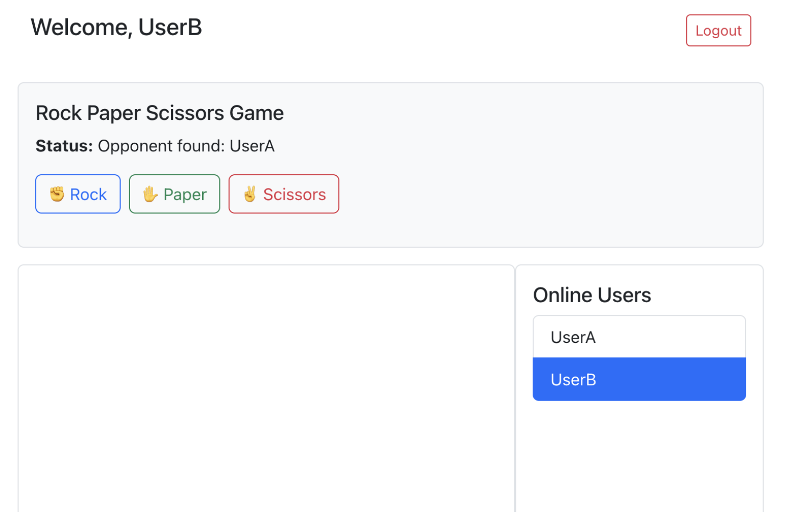

# 参考例：RPS ゲーム

!!! info "このページについて"
    このページは、第2回レポート課題の参考として用意した RPS ゲームの実装例である。  
    RPS とは Rock-Paper-Scissors の略であり、日本語の「じゃんけん」に相当する。

    このページの目的は、Socket.IO を使った簡単なオンライン対戦ゲームの作り方を理解することである。

!!! warning "重要"
    このページは「参考例」である。  
    RPS ゲームを必ず作る必要はない。  
    また、このコードをそのまま提出することは不可である。  

    第2回レポート課題として提出する場合は、ルール、画面デザイン、メッセージ表示、スコア機能などに、自分なりの改良を加えること。

---

## 1. このゲームで作るもの

このページでは、Socket.IO を用いて、2人で対戦できる RPS ゲームを作成する。

RPS ゲームでは、2人のプレイヤーがそれぞれ次のどれかを選ぶ。

| 英語 | 日本語 |
|---|---|
| `rock` | グー |
| `paper` | パー |
| `scissors` | チョキ |

2人の選択がそろうと、サーバーが勝敗を判定し、両方の画面に結果を表示する。



*図1：RPSゲームの画面例*

---

## 2. この例で学ぶこと

この例では、以下の内容を学ぶことができる。

- Socket.IO を使ってゲーム参加イベントを送る方法
- サーバー側で待機中のユーザーを管理する方法
- 2人のユーザーを自動でマッチングする方法
- 2人の選択がそろった後に勝敗を判定する方法
- React コンポーネントでゲーム画面を表示する方法
- `App.js` から別ファイルのゲームコンポーネントを読み込む方法

---

## 3. 完成時のファイル構成

この例では、React 側に `RPSGame.js` を追加する。

開発中のフォルダ構成は、次のようになる。

```text
report2/
├── client/
│   └── src/
│       ├── App.js
│       ├── RPSGame.js
│       └── ...
└── server/
    └── server.js
```

!!! note "注意"
    `RPSGame.js` は `client/src/` の中に作成する。  
    `server.js` は `server/` の中にあるファイルを編集する。

---

## 4. ゲーム全体の流れ

RPS ゲームの基本的な流れは次の通りである。

1. ユーザーAがゲームに参加する
2. ユーザーAは待機キューに入る
3. ユーザーBがゲームに参加する
4. サーバーがユーザーAとユーザーBをマッチングする
5. 両方の画面に対戦相手の名前が表示される
6. それぞれが `rock`, `paper`, `scissors` のどれかを選ぶ
7. サーバーが勝敗を判定する
8. 両方の画面に結果が表示される
9. 「Play Again」を押すと、再度マッチングに参加できる

---

## 5. 主な Socket.IO イベント

このゲームでは、主に次の Socket.IO イベントを使う。

| イベント名 | 送信元 | 送信先 | 役割 |
|---|---|---|---|
| `join_rps` | クライアント | サーバー | RPSゲームへの参加を要求する |
| `rps_start` | サーバー | クライアント | 対戦相手が見つかったことを通知する |
| `rps_choice` | クライアント | サーバー | 自分の手を送信する |
| `rps_result` | サーバー | クライアント | 勝敗結果を通知する |

!!! tip "レポートで使える内容"
    第2回レポートでは、使用した Socket.IO イベントを表にまとめる必要がある。  
    上の表は、レポートの「内部仕様」の参考にできる。

---

## 6. サーバー側の実装

ここからは、`server/server.js` に RPS ゲーム用の処理を追加する。

---

### 6.1 ゲーム状態を管理する変数を追加する

まず、RPS ゲームの状態を管理するために、次の2つの変数を追加する。

```js
const waitingUsers = []; // RPS の対戦待ちユーザーを入れるキュー
const rpsGames = new Map(); // username → { opponent, choice, socket }
```

追加する場所の例は次の通りである。

#### このコードのポイント

- `waitingUsers` は、相手が見つかっていない参加者を一時的に待機させるための配列である
- `rpsGames` は、対戦中の情報を保存しておくための Map である
- ここで状態を管理しておくことで、どのユーザーが対戦中かを把握しやすくなる

```js
const users = new Map();

const waitingUsers = []; // RPS の対戦待ちユーザーを入れるキュー
const rpsGames = new Map(); // username → { opponent, choice, socket }
```

#### 変数の意味

`waitingUsers` は、まだ対戦相手が見つかっていないユーザーを入れる配列である。  
1人目が参加した時点では、まだ対戦相手がいないため、この配列の中で待つ。

`rpsGames` は、現在進行中のゲーム情報を保存するための `Map` である。  
ユーザー名をキーとして、相手の名前、自分の選択、ソケット情報を保存する。

---

### 6.2 勝者を判定する関数を追加する

次に、じゃんけんの勝敗を判定する関数を追加する。

```js
function determineWinner(choice1, choice2) {
  if (choice1 === choice2) return null; // draw

  if (
    (choice1 === 'rock' && choice2 === 'scissors') ||
    (choice1 === 'scissors' && choice2 === 'paper') ||
    (choice1 === 'paper' && choice2 === 'rock')
  ) {
    return 1; // player 1 wins
  }

  return 2; // player 2 wins
}
```

この関数は、2人の選択を比較して、次の値を返す。

#### このコードのポイント

- じゃんけんの勝敗は、3つの組み合わせを比べて決める
- `return null` で引き分けを表す
- サーバー側で勝敗を一元管理することで、クライアント側の処理を簡単にできる

| 戻り値 | 意味 |
|---|---|
| `1` | 1人目のプレイヤーが勝ち |
| `2` | 2人目のプレイヤーが勝ち |
| `null` | 引き分け |

---

### 6.3 ログイン時に socket.username を保存する

ログイン処理の中で、`socket.username` にユーザー名を保存する。

すでに次のようなログイン処理があるとする。

```js
socket.on('login', (username) => {
  users.set(socket.id, username);
  console.log(`${username} logged in.`);
  broadcastUserList();
});
```

これを次のように変更する。

```js
socket.on('login', (username) => {
  users.set(socket.id, username);
  socket.username = username;

  console.log(`${username} logged in.`);
  broadcastUserList();
});
```

!!! note "なぜ socket.username が必要か"
    `disconnect` などの処理では、`socket` からユーザー名を確認したい場合がある。  
    そのため、ログイン時に `socket.username = username;` として保存しておくと、ゲーム処理が書きやすくなる。

---

### 6.4 join_rps イベントを追加する

`join_rps` は、ユーザーが RPS ゲームに参加するときに使うイベントである。

`io.on('connection', (socket) => { ... })` の中に、次のコードを追加する。

```js
socket.on('join_rps', (username) => {
  socket.username = username;

  // 同じ socket が二重にキューへ入らないようにする
  if (waitingUsers.find((s) => s.id === socket.id)) {
    console.log(`[RPS] ${username} already in queue.`);
    return;
  }

  console.log(`${username} joined RPS queue.`);
  waitingUsers.push(socket);

  // 2人以上待っていればマッチングする
  if (waitingUsers.length >= 2) {
    const player1 = waitingUsers.shift();
    const player2 = waitingUsers.shift();

    // 同じユーザー同士がマッチしないようにする
    if (player1.id === player2.id || player1.username === player2.username) {
      console.log(`[RPS] Prevented self-match (${player1.username}).`);
      waitingUsers.unshift(player2);
      return;
    }

    console.log('Matched RPS players:', player1.username, player2.username);

    // player1 のゲーム情報を保存する
    rpsGames.set(player1.username, {
      opponent: player2.username,
      choice: null,
      socket: player1,
    });

    // player2 のゲーム情報を保存する
    rpsGames.set(player2.username, {
      opponent: player1.username,
      choice: null,
      socket: player2,
    });

    // 両方のプレイヤーにゲーム開始を通知する
    player1.emit('rps_start', { opponent: player2.username });
    player2.emit('rps_start', { opponent: player1.username });
  }
});
```

#### このコードの動き

このコードでは、まず参加したユーザーを `waitingUsers` に追加する。  
その後、`waitingUsers` に2人以上いれば、先に入った2人を取り出してマッチングする。

マッチング後は、それぞれのプレイヤーに `rps_start` イベントを送信する。  
このイベントを受け取ったクライアントは、対戦相手の名前を画面に表示する。

#### このコードのポイント

- `waitingUsers` に入れた後、2人揃った時点で対戦を開始する
- 1人ずつ順番に待機させることで、簡単なマッチング機能を作れる
- `player1.emit()` と `player2.emit()` で、両者に同じ情報を送る

---

### 6.5 rps_choice イベントを追加する

`rps_choice` は、プレイヤーが `rock`, `paper`, `scissors` のどれかを選んだときに使うイベントである。

`io.on('connection', (socket) => { ... })` の中に、次のコードを追加する。

```js
socket.on('rps_choice', ({ user, choice }) => {
  const game = rpsGames.get(user);
  if (!game) return;

  game.choice = choice;

  const opponentName = game.opponent;
  const opponentGame = rpsGames.get(opponentName);

  // 相手がまだ選んでいない場合は待つ
  if (!opponentGame || opponentGame.choice === null) {
    console.log(`[RPS] ${user} chose ${choice}, waiting for opponent ${opponentName}`);
    return;
  }

  const opponentChoice = opponentGame.choice;
  const winnerCode = determineWinner(choice, opponentChoice);

  let winner = null;
  if (winnerCode === 1) winner = user;
  else if (winnerCode === 2) winner = opponentName;

  const choices = {
    [user]: choice,
    [opponentName]: opponentChoice,
  };

  // 両方のプレイヤーに結果を送る
  game.socket.emit('rps_result', { winner, choices });
  opponentGame.socket.emit('rps_result', { winner, choices });

  // ゲーム情報を削除する
  rpsGames.delete(user);
  rpsGames.delete(opponentName);
});
```

#### このコードの動き

1人目が手を選んだ時点では、まだ相手が選んでいない可能性がある。  
その場合は、勝敗判定をせずに待つ。

2人目も手を選ぶと、両方の選択がそろう。  
その時点で `determineWinner()` を使って勝敗を判定し、両方の画面へ `rps_result` を送信する。

#### このコードのポイント

- `opponentGame.choice === null` で、相手がまだ選択していないかを確認している
- 2人とも選択した時点で、同じ結果を両方に送信する
- `rpsGames.delete()` で、対戦が終わったらデータを削除している

---

### 6.6 disconnect 処理を拡張する

ユーザーが切断したとき、RPS ゲームの待機キューやゲーム情報からも削除する必要がある。

すでに `disconnect` 処理がある場合は、その中に以下の処理を追加する。

```js
socket.on('disconnect', () => {
  const username = users.get(socket.id);

  if (username) {
    console.log(`User disconnected: ${username} (Socket ID: ${socket.id})`);
    users.delete(socket.id);
    broadcastUserList();
  }

  // RPS の待機キューから削除する
  const index = waitingUsers.findIndex((s) => s.id === socket.id);
  if (index !== -1) {
    waitingUsers.splice(index, 1);
  }

  // 進行中の RPS ゲームに参加していた場合
  if (socket.username && rpsGames.has(socket.username)) {
    const opponentName = rpsGames.get(socket.username).opponent;
    const opponentGame = rpsGames.get(opponentName);

    if (opponentGame) {
      opponentGame.socket.emit('rps_result', {
        winner: opponentName,
        choices: {
          [opponentName]: opponentGame.choice || 'unknown',
          [socket.username]: 'left game',
        },
      });

      rpsGames.delete(opponentName);
    }

    rpsGames.delete(socket.username);
  }
});
```

!!! warning "注意"
    `disconnect` の処理を2回書くと、意図しない動作になることがある。  
    すでに `socket.on('disconnect', ...)` がある場合は、新しく作るのではなく、既存の `disconnect` の中に RPS 用の処理を追加すること。

---

## 7. React 側の実装：RPSGame.js

次に、React 側に `RPSGame.js` を作成する。

作成する場所は次の通りである。

```text
client/src/RPSGame.js
```

---

### 7.1 RPSGame.js の完成例

以下を `client/src/RPSGame.js` に書く。

```jsx
import React, { useEffect, useState } from 'react';

function RPSGame({ socket, username }) {
  const [opponent, setOpponent] = useState(null);
  const [choice, setChoice] = useState('');
  const [result, setResult] = useState('');
  const [status, setStatus] = useState('');
  const [hasJoined, setHasJoined] = useState(false);

  useEffect(() => {
    if (socket && username && !hasJoined) {
      console.log('[CLIENT] auto join_rps for', username);
      socket.emit('join_rps', username);
      setStatus('Waiting for match...');
      setHasJoined(true);
    }
  }, [socket, username, hasJoined]);

  useEffect(() => {
    if (!socket || !username) return;

    const handleStart = ({ opponent }) => {
      console.log('[CLIENT] Got opponent:', opponent);
      setOpponent(opponent);
      setChoice('');
      setResult('');
      setStatus(`Opponent found: ${opponent}`);
    };

    const handleResult = ({ winner, choices }) => {
      const opponentName = Object.keys(choices).find((name) => name !== username);
      const userChoice = choices[username];
      const opponentChoice = choices[opponentName];

      setResult(
        `You chose ${userChoice}, ${opponentName} chose ${opponentChoice}. ` +
          (winner === username
            ? '🎉 You win!'
            : winner === opponentName
            ? '😞 You lose!'
            : "🤝 It's a draw.")
      );

      setStatus(
        winner === username
          ? '🎉 You win! Click to play again.'
          : winner === opponentName
          ? '😞 You lose! Click to play again.'
          : "🤝 It's a draw! Click to play again."
      );
    };

    socket.on('rps_start', handleStart);
    socket.on('rps_result', handleResult);

    return () => {
      socket.off('rps_start', handleStart);
      socket.off('rps_result', handleResult);
    };
  }, [socket, username]);

  const sendChoice = (hand) => {
    if (!opponent || choice) return;

    setChoice(hand);
    setStatus('Waiting for opponent...');
    socket.emit('rps_choice', { user: username, choice: hand });
  };

  const playAgain = () => {
    socket.emit('join_rps', username);
    setOpponent(null);
    setChoice('');
    setResult('');
    setStatus('Waiting for match...');
  };

  return (
    <div className="mt-4 p-3 border bg-light rounded">
      <h5>Rock Paper Scissors Game</h5>

      <p>
        <strong>Rule:</strong> Choose Rock, Paper, or Scissors. When both players choose,
        the server decides the winner.
      </p>

      <p>
        <strong>Status:</strong> {status}
      </p>

      {!choice && opponent && (
        <div className="mb-3">
          <button
            className="btn btn-outline-primary me-2"
            onClick={() => sendChoice('rock')}
          >
            ✊ Rock
          </button>

          <button
            className="btn btn-outline-success me-2"
            onClick={() => sendChoice('paper')}
          >
            ✋ Paper
          </button>

          <button
            className="btn btn-outline-danger"
            onClick={() => sendChoice('scissors')}
          >
            ✌ Scissors
          </button>
        </div>
      )}

      {choice && !result && (
        <p className="text-muted">
          You chose <strong>{choice}</strong>. Waiting for opponent...
        </p>
      )}

      {result && (
        <div>
          <div className="alert alert-info">{result}</div>
          <button className="btn btn-primary" onClick={playAgain}>
            🔁 Play Again
          </button>
        </div>
      )}
    </div>
  );
}

export default RPSGame;
```

#### このコードのポイント

- `useEffect()` は、コンポーネントが読み込まれたときに一度だけ処理を実行するために使う
- `socket.on('rps_start', handleStart)` で、対戦相手が見つかった時の処理を登録する
- `sendChoice()` は、選んだ手をサーバーへ送る処理である
- `playAgain()` は、もう一度ゲームを始めるための処理である

---

### 7.2 RPSGame.js の主な state

`RPSGame.js` では、次の state を使う。

| state | 役割 |
|---|---|
| `opponent` | 対戦相手のユーザー名を保存する |
| `choice` | 自分が選んだ手を保存する |
| `result` | 勝敗結果のメッセージを保存する |
| `status` | 現在の状態を表示する |
| `hasJoined` | 同じユーザーが何度も自動参加しないようにする |

---

## 8. App.js に RPSGame を読み込む

作成した `RPSGame.js` は、`App.js` から読み込む必要がある。

---

### 8.1 import 文を追加する

`App.js` の上の方に、次の import 文を追加する。

```jsx
import RPSGame from './RPSGame';
```

Bootstrap をまだ読み込んでいない場合は、次の import も追加する。

```jsx
import 'bootstrap/dist/css/bootstrap.min.css';
```

---

### 8.2 return の中に RPSGame を追加する

ログイン後の画面、またはチャット画面の下などに、次のように追加する。

```jsx
<div className="mt-4">
  <RPSGame socket={socketRef.current} username={username} />
</div>
```

!!! note "props の意味"
    `socket={socketRef.current}` は、現在接続している Socket.IO の接続情報を RPSGame に渡している。  
    `username={username}` は、ログイン中のユーザー名を RPSGame に渡している。

---

## 9. 動作確認の方法

RPS ゲームは2人でプレイするゲームである。  
そのため、動作確認ではブラウザを2つ開く必要がある。

---

### 9.1 サーバーを起動する

ターミナルで `server` フォルダに移動し、サーバーを起動する。

```bash
cd server
node server.js
```

---

### 9.2 クライアントを起動する

別のターミナルで `client` フォルダに移動し、React アプリを起動する。

```bash
cd client
npm start
```

---

### 9.3 2つのブラウザで確認する

次のようにして2人分のユーザーを用意する。

1. 1つ目のブラウザでログインする
2. 2つ目のブラウザ、またはシークレットウィンドウでログインする
3. それぞれ違うユーザー名を使う
4. 両方の画面で RPS ゲームが表示されることを確認する
5. 両方のユーザーが手を選ぶ
6. 両方の画面に同じ結果が表示されることを確認する

!!! tip "確認のコツ"
    1つのブラウザだけでは、相手がいないためマッチングが完了しない。  
    必ず2つのブラウザ、または通常ウィンドウとシークレットウィンドウを使って確認すること。

---

## 10. よくあるエラーと確認点

### 10.1 ボタンが表示されない

以下を確認すること。

- 2人のユーザーでログインしているか
- 2人が同じサーバーに接続しているか
- `join_rps` が送信されているか
- サーバーのコンソールに `Matched RPS players` が表示されているか
- `RPSGame` を `App.js` の return 内に追加しているか

---

### 10.2 結果が表示されない

以下を確認すること。

- 両方のユーザーが手を選んだか
- `rps_choice` がサーバーに届いているか
- `determineWinner()` が `server.js` に追加されているか
- `socket.on('rps_result', handleResult)` が `RPSGame.js` に書かれているか

---

### 10.3 同じユーザーが何度もマッチングされる

以下を確認すること。

- `hasJoined` を使っているか
- `waitingUsers.find((s) => s.id === socket.id)` のチェックがあるか
- `Play Again` を押したときだけ `join_rps` を再送しているか

---

### 10.4 サーバー側を編集したのに反映されない

`server.js` を編集した場合は、サーバーを再起動する必要がある。

```bash
Ctrl + C
node server.js
```

React 側の `App.js` や `RPSGame.js` は、保存すると自動的に反映されることが多い。  
しかし、サーバー側は自動で更新されないため注意すること。

---

## 11. このまま提出してはいけない理由

このページのコードは参考例である。  
第2回レポート課題では、自分なりの改良点が必要である。

単にコードをコピーしただけの場合、オリジナリティが不足する。  
また、他の学生と内容が同じになりやすく、不正行為と判断される可能性がある。

!!! warning "提出時の注意"
    補足資料またはこのページのコードをそのまま提出することは不可である。  
    必ず、ルール、画面、メッセージ、機能、デザインなどに自分なりの変更を加えること。

---

## 12. 改良案

RPS ゲームをもとに、以下のような改良ができる。

---

### 12.1 スコア機能を追加する

勝った回数を表示する機能である。

例：

```text
UserA: 2 points
UserB: 1 point
```

---

### 12.2 ベストオブ3にする

1回だけで勝敗を決めるのではなく、3回中2回勝った方を勝者にするルールである。

---

### 12.3 タイマーを追加する

一定時間内に手を選ばないと負けになるルールである。

例：

```text
10秒以内に選択してください。
```

---

### 12.4 結果メッセージをカスタマイズする

勝敗結果の表示を、自分のテーマに合わせて変更する。

例：

```text
🔥 Great choice!
😱 Too slow!
🎯 Nice prediction!
```

---

### 12.5 UI を改良する

色、レイアウト、ボタン、背景、フォントなどを変更する。

例：

- カード型レイアウトにする
- 勝ったときの色を変える
- アイコンを追加する
- ボタンを大きくする
- スマートフォンでも見やすくする

---

### 12.6 別のゲームに発展させる

RPS の構造は、他の簡単な対戦ゲームにも応用できる。

| 発展例 | 内容 |
|---|---|
| 5種じゃんけん | Rock, Paper, Scissors に Lizard, Spock を追加する |
| 〇×ゲーム | 交互にマスを選び、3つ並べたら勝ちにする |
| クイズ対戦 | 同じ問題を表示し、早く正解した方を勝ちにする |
| リアクションゲーム | 合図が出た後、早くボタンを押した方を勝ちにする |
| 数字当てゲーム | サーバーが決めた数字を当てる |
| 同時選択ゲーム | 2人が同時に選び、あとで結果を公開する |

---

## 13. レポートに書ける内容の例

RPS ゲームをもとにレポートを書く場合、以下のような内容を説明できる。

---

### 13.1 外部仕様の例

外部仕様では、ユーザーから見たアプリの機能を書く。

```text
本アプリでは、ログインしたユーザーがチャット機能を利用できる。
また、RPSゲーム画面では、他のユーザーと自動的にマッチングされ、
rock、paper、scissors のいずれかを選択して対戦できる。
両者の選択がそろうと、サーバーが勝敗を判定し、結果を画面に表示する。
```

---

### 13.2 内部仕様の例

内部仕様では、開発者向けにプログラムの構成を書く。

```text
RPSゲームでは、サーバー側で waitingUsers と rpsGames を用いてゲーム状態を管理している。
waitingUsers は対戦待ちユーザーのキューであり、2人そろった時点でマッチングを行う。
rpsGames は進行中のゲーム情報を保存する Map であり、各ユーザーの対戦相手、選択内容、socket 情報を保持する。
```

---

### 13.3 Socket.IO イベント表の例

| イベント名 | 引数 | 役割 |
|---|---|---|
| `join_rps` | `username` | RPSゲームへの参加要求を送信する |
| `rps_start` | `{ opponent }` | 対戦相手が見つかったことを通知する |
| `rps_choice` | `{ user, choice }` | プレイヤーの選択を送信する |
| `rps_result` | `{ winner, choices }` | 勝敗結果と両者の選択を通知する |

---

## 14. チェックリスト

提出前に、以下を確認すること。

- [ ] 2人のユーザーで RPS ゲームをプレイできる
- [ ] `RPSGame.js` を `client/src/` に作成した
- [ ] `App.js` から `RPSGame` を import している
- [ ] `server.js` に `join_rps` を追加した
- [ ] `server.js` に `rps_choice` を追加した
- [ ] `server.js` に `determineWinner()` を追加した
- [ ] `disconnect` 時に RPS の情報を削除している
- [ ] 画面上にゲームのルールを表示している
- [ ] 自分なりの改良を加えた
- [ ] 名前と学籍番号がアプリ上に表示されている

---

## 15. 難易度

この参考例の難易度は以下の通りである。

| 項目 | 難易度 |
|---|---|
| 基本実装 | Easy |
| UI 改良 | Easy |
| スコア機能追加 | Medium |
| ベストオブ3 | Medium |
| タイマー追加 | Medium |
| 5種じゃんけんへの拡張 | Medium |
| 〇×ゲームへの発展 | Hard |

---

## 16. まとめ

RPS ゲームは、Socket.IO を使ったオンライン対戦ゲームの基本構造を学ぶための参考例である。  
待機キュー、マッチング、選択送信、勝敗判定、結果表示という流れは、多くのオンラインゲームに応用できる。

ただし、第2回レポート課題では、この参考例をそのまま提出するのではなく、自分なりの工夫を加える必要がある。  
ルール、UI、メッセージ、スコア、タイマーなどを変更し、オリジナル性のあるアプリとして完成させること。